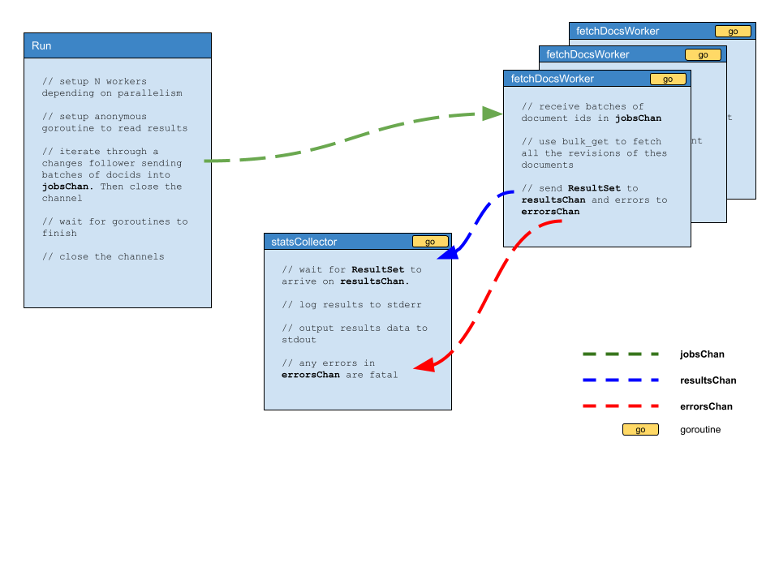

# cloudantbackup

A backup utility for Cloudant databases.

## Installation

You will need to [download and install the Go compiler](https://go.dev/doc/install). Clone this repo then:

```sh
go build
```

Then copy the resultant binary `cloudantbackup` (or `cloudantbackup.exe` in Windows systems) into your path.

## Configuration

`cloudantbackup` authenticates with your chosen Cloudant service using environment variables as documented [here](https://github.com/IBM/cloudant-go-sdk/blob/v0.10.8/docs/Authentication.md#authentication-with-environment-variables) e.g.

```sh
CLOUDANT_URL=https://xxxyyy.cloudantnosqldb.appdomain.cloud
CLOUDANT_APIKEY="my_api_key"
```

## Usage

Supply the name of the database to be backed up and pipe the output to a file:

```sh
cloudantbackup --db mydb > mydb.txt
```

## Parameters

- `--db` - the database name to backup (REQUIRED)
- `--parallelism` - the number of http requests in flight at any one time (default: 5)
- `--buffer-size` - the number of documents fetched with each bulk read request (default: 500)
- `--mode` - the backup mode. Either `full` or `shallow`. A `full` backup fetches all the revisions of each document, a `shallow` backup just fetches the winning revision. (default: full)
- `--log` - the filename where the backup log will be stored (not the backup data itself) (optional)
- `--resume` - a flag to indicate that a previously incomplete backup should be resumed (`--log` also required) (optional)

e.g.

```sh
cloudantbackup --db mydb --parallelism 10 --buffer-size 1000 --mode shallow > mydb.txt
```

## Output

The backup itself is written to stdout. It consists of a header line followed by one line per batch of backed-up documents:

```json
{"name":"@cloudant/couchbackup","version":"2.9.10","mode":"full"}
[{"_id":"a","_rev":"1-123","x":1}...]
```

A progress log is written to stderr:

```
025/11/25 11:37:35 saved 500 docs. Total: 500
2025/11/25 11:37:35 saved 500 docs. Total: 1000
2025/11/25 11:37:35 saved 500 docs. Total: 1500
2025/11/25 11:37:35 saved 500 docs. Total: 2000
2025/11/25 11:37:35 saved 500 docs. Total: 2500
2025/11/25 11:37:35 saved 500 docs. Total: 3000
2025/11/25 11:37:35 saved 500 docs. Total: 3500
2025/11/25 11:37:35 saved 500 docs. Total: 4000
2025/11/25 11:37:36 saved 500 docs. Total: 4500
2025/11/25 11:37:36 saved 500 docs. Total: 5000
2025/11/25 11:37:36 saved 500 docs. Total: 5500
2025/11/25 11:37:36 saved 500 docs. Total: 6000
2025/11/25 11:37:36 saved 500 docs. Total: 6500
2025/11/25 11:37:36 saved 500 docs. Total: 7000
2025/11/25 11:37:36 saved 500 docs. Total: 7500
2025/11/25 11:37:36 saved 500 docs. Total: 8000
2025/11/25 11:37:36 saved 500 docs. Total: 8500
2025/11/25 11:37:36 saved 500 docs. Total: 9000
2025/11/25 11:37:36 saved 500 docs. Total: 9500
2025/11/25 11:37:36 saved 500 docs. Total: 10000
2025/11/25 11:37:36 saved 500 docs. Total: 10500
2025/11/25 11:37:36 saved 500 docs. Total: 11000
2025/11/25 11:37:36 saved 500 docs. Total: 11500
2025/11/25 11:37:36 saved 500 docs. Total: 12000
2025/11/25 11:37:36 saved 500 docs. Total: 12500
2025/11/25 11:37:36 saved 500 docs. Total: 13000
2025/11/25 11:37:36 saved 500 docs. Total: 13500
2025/11/25 11:37:36 saved 500 docs. Total: 14000
2025/11/25 11:37:36 saved 500 docs. Total: 14500
2025/11/25 11:37:36 saved 500 docs. Total: 15000
2025/11/25 11:37:36 saved 500 docs. Total: 15500
2025/11/25 11:37:38 saved 500 docs. Total: 16000
2025/11/25 11:37:38 saved 500 docs. Total: 16500
2025/11/25 11:37:38 saved 500 docs. Total: 17000
2025/11/25 11:37:38 saved 500 docs. Total: 17500
2025/11/25 11:37:38 saved 500 docs. Total: 18000
2025/11/25 11:37:38 saved 500 docs. Total: 18500
2025/11/25 11:37:38 saved 500 docs. Total: 19000
2025/11/25 11:37:38 Changes follower complete. 23541 changes
2025/11/25 11:37:38 saved 500 docs. Total: 19500
2025/11/25 11:37:38 saved 500 docs. Total: 20000
2025/11/25 11:37:38 saved 500 docs. Total: 20500
2025/11/25 11:37:38 saved 500 docs. Total: 21000
2025/11/25 11:37:38 saved 500 docs. Total: 21500
2025/11/25 11:37:38 saved 500 docs. Total: 22000
2025/11/25 11:37:38 saved 41 docs. Total: 22041
2025/11/25 11:37:38 saved 500 docs. Total: 22541
2025/11/25 11:37:38 saved 500 docs. Total: 23041
2025/11/25 11:37:38 saved 500 docs. Total: 23541
```

## How does it work?

To remind myself of what's going on, this diagram helps:


